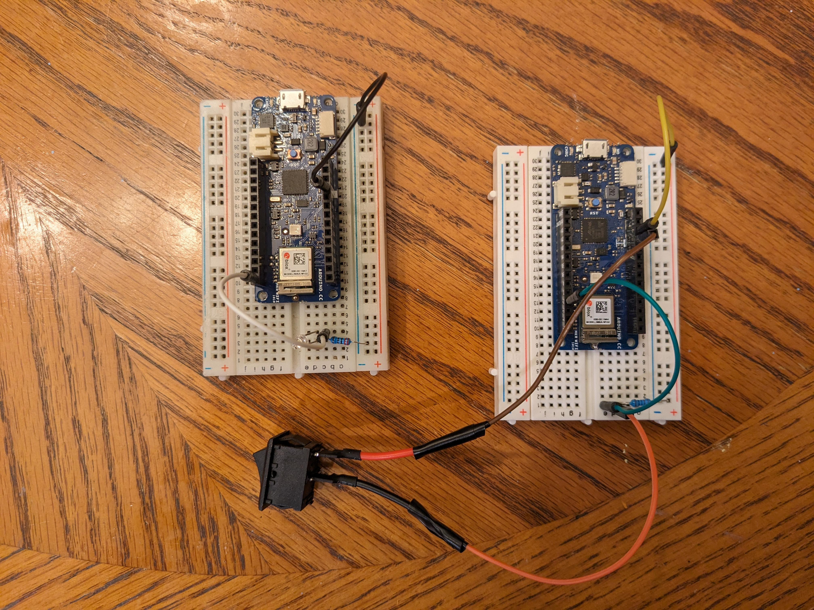

# BLE Wire Replacement
Docs 10-26-23 V1 (For questions or comments:  Stephen Witty switty@level500.com)  

### Project Overview:
Testing MKR1010 using BLE as a GPIO wire replacement between two boards.  One MCU has a switch that when flipped sends a signal across BLE to another MCU that has a LED that turns on or off as needed.  The project uses stock BLE example code for the MKR1010 with very minor modifications.
  

### Demo Video:
https://youtu.be/S71SKZ-hXno

### Usage:

- Two MKR1010s
- One MKR1010 acts as the LED and the other is the switch
- LED MKR1010 has a LED and resistor connected to GPIO 5
- Switch MKR1010 has a switch connected to GPIO 2 with a pull-up resistor
